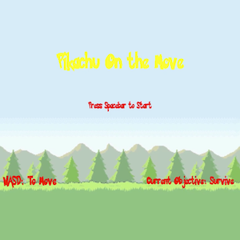
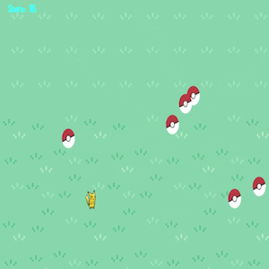

  
  
  

Pikachu On The Move is a game that I helped developed as a team in the course 'Intro to Computer Science I'. The purpose of the project was to experience working with other people and have the ability to make a program using Java by applying the concepts we learned over the semester. As a group, we decided to make a game with the theme based from the game franchise, "Pokemon". Using the controls, W - up, A - left, S - down, D - right, to move the main character 'Pikachu', the goal of the game is to avoid being caught by the pokemon balls, while getting the highest survival time as possible.

For this project, I created the controlling character 'Pikachu'; I was responsible of making a class allowing the player to move as Pikachu. In this project, some of the concepts that were used was: Finite State Machines & Private, Public member variables and Member functions. The class I made allowed WASD as the controls. In whatever direction Pikachu moved in, for example going left, the picture of the moving Pikachu would face left. Same goes for right, up, and down. 

This project demonstrates my ability and efficiency to create a Java program, and used what I have learned over a semester. By working as a team, it allowed me to experience what it's like to work in a group as a computer science student. ICS 111 was the start of my career as an ICS student. It gave me a perspective on myself on what I'm capable of doing.

