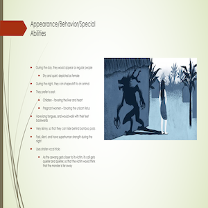

This project surrounds the culture of the Philippines. During the Fall 2019 semester, I took Philippine Pop Culture, and continuing my proficiency in Filipino language at the intermediate level. In my Philippine Pop Culture class, we learned about the mythical creature in the Philippines called the 'Aswang'. The Aswang is a cryptid in Filipino folklore that is generically a term applied to all types of witches, vampires, werewolves, and ghouls. In class, we watched a documentary that explains the meaning of 'Aswang'. Rather than just a mythical creature in Filipino folklore, it symbolizes those in authority during the time the Philippines was colonized by the Spaniards. As part of the Ilokano Language, Culture, and Literature Program, we were required to create a video project summarizing what we learned over the course. Also for my Filipino language class, I decided to present about the mythical creature as my final oral project.

For our video project, we came to a concensus to make a horror type video about students trying to make a video project about the Aswang, but unfortunately meeting their end when the Aswang begins to attack. In my Filipino language class, I chose the topic 'Aswang' because I had previous knowledge about it and wanted to share what I learned in my Philippine Pop Culture class. In class, I had to present my presentation majority in Filipino, improving my Filipino-speaking skills. 

In both projects, I experienced making a video as a group in my college career and was able to improve my proficiency in Filipino language. I got to learn and understand more about the Philippine culture, and was able to share my knowledge amongst other students. 
