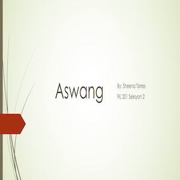

For the first project in ICS 111, I had to as decribed, "develop a graffiti app where you use your mouse to move a spray can and when you press the mouse button, the can sprays paint onto the wall". Using Java, we can change the paint color with either the 1 or 2 keys. 

I was a beginner in coding in Java, so I was able to use the skills I've learned for this project. We had to implement [EZ Graphics](http://www2.hawaii.edu/~dylank/ics111/) to create a small window where the player can draw using the mouse click. 

This project is significant to me because it was the first program I developed as a computer scientist at UH Manoa. I had the experience of learning Java, and was put in through the test to demonstrate what I've learned. This project gave me a perspective of working independently and discover what I can do in Java.

Here is a [link](https://www.youtube.com/watch?v=-fek-ypzLCc) showcasing my project!
