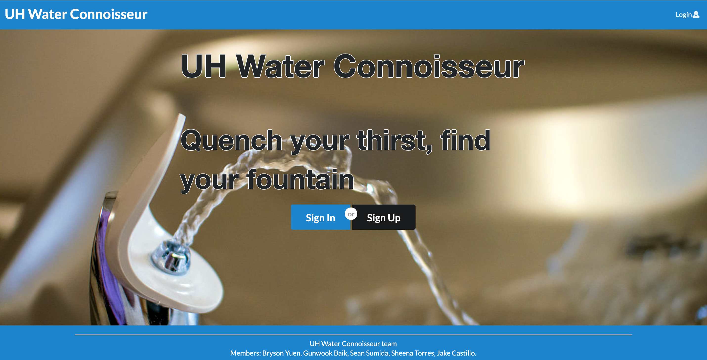
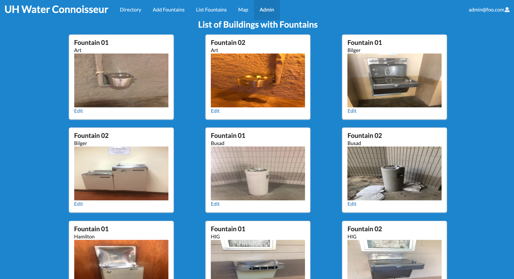
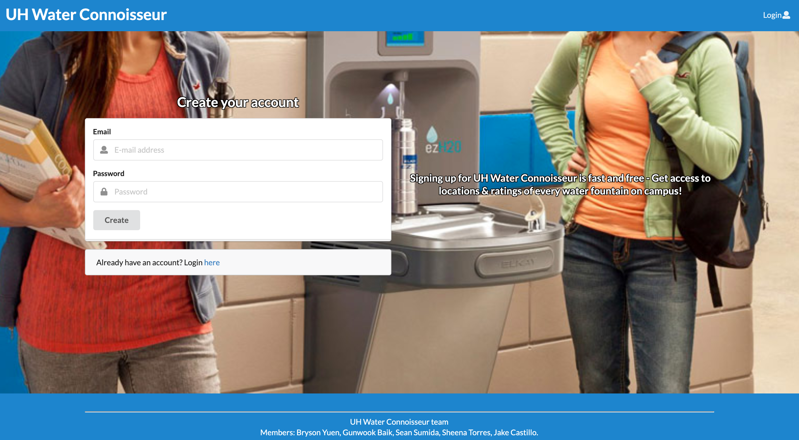
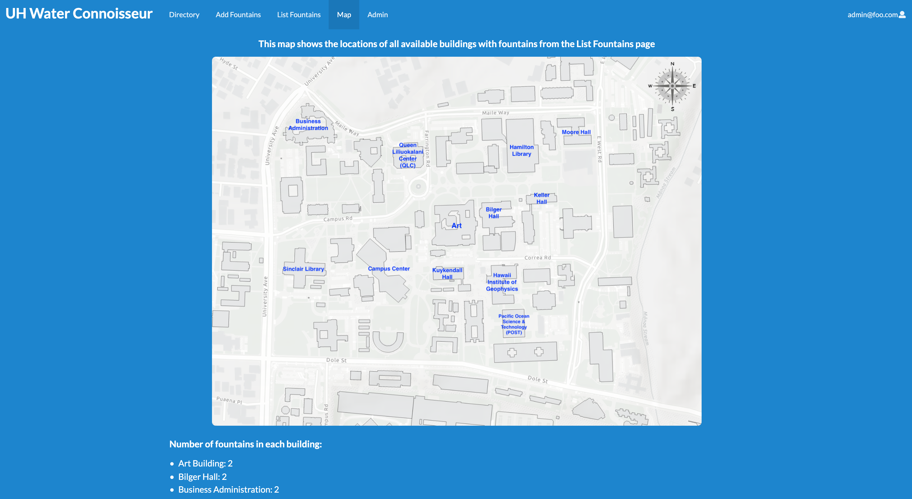

In my Software Engineering I class at UH Manoa, ICS 314, we had to complete a final project where we had to apply concepts and skills we had learned and gained throughout the course of the semester. We were distributed into teams, and were expected to complete a web application development.

This web application we have developed, called UH Water Connoisseur, primarily purpose was to organize and present different water fountains that are located in the UH Manoa campus. The main purpose of our app was to allow users to review water fountains on the campus. After logging into the app, users are able to submit water fountains and reviews that are not currently on the list of fountains. They are then able to view water fountains and be able to locate them on campus based on the building the water fountain is in and what floor it is on. If students at UH Manoa have no water bottle or accessibility to buy water, they can use our web app to locate any water fountain and determine which is good based on ratings, or whichever is closer to them.

 

In our app, there is admin which allows access to a list of all current water fountains. Whenever a user submits a request to add a fountain and a review, the admin will have the ability to view and accept or edit the request. 

 
 

In regards to my contribution to the project, I was in charge of creating the sign up page, updating the admin page, and making a map. For the sign up page, users have the ability to sign in which allowed them to have access to add fountains and the list of all building with fountains. I have also updated the admin page, in which I have mention earlier, that allows admin to view all current fountains. Lastly, the other contribution I have worked on in this project was the map page. The map page consists a map of the UH Manoa campus that is labeled with the buildings that have water fountains. It also includes information on how much water fountains there are that are currently added to the list of water fountains.

 
 
 
 
 
 
 

In all, this project was an opportunity to showcase my skills of using user interface frameworks, such as Semantic UI React. Also, being able to work in teams. By working in teams, we were able to adapt to issue drive management. I was able to apply concepts I have learned in this software engineering class and demonstrate what I am capable of doing. By completing this final project, it has expanded my perspective in software development and gained the experience to create a web application.

If you are interested in learning more about this web application, here is a link to the [UH Water Fountains' Organization GitHub Page](https://github.com/uh-waterfountain). 

Here is also our [UH Water Fountains GitHub Home Page](https://uh-waterfountain.github.io/), which contains more information about our app, such as user guides, developer guide, and our development history.

